Sally Dashboard
===============

[](https://packagist.org/packages/sally/dashboard)
[](LICENCE)
[](https://packagist.org/packages/sally/dashboard) 
[](https://www.codacy.com/app/sally/dashboard)
[](https://vk.com/n0tm3)

This is simple  dashboard with charts which will save statistics of your projects. Easy to use. Beautiful in action.
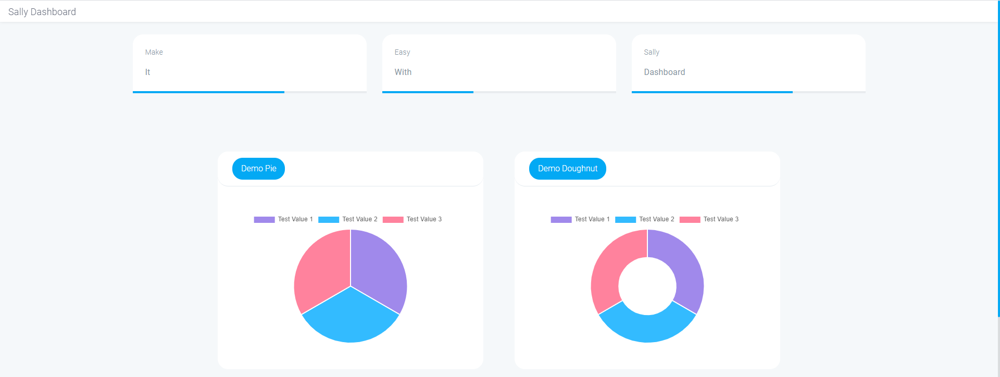

# Getting Started
## Install
First of all download package via composer run the following command
```bash
$ composer require sally/dashboard
```

Add Service Provider to `config/app.php` in `providers` section
```php
\Sally\Dashboard\DashboardServiceProvider::class,
```

Then run this command to publish assets
```bash
$ php artisan vendor:publish --provider="Sally\Dashboard\DashboardServiceProvider"
```

Add a route in your web routes file:
```php 
Route::get('dashboard', '\Sally\Dashboard\Controller\DashboardController@index');
```

if you are doing fine you will see something like this
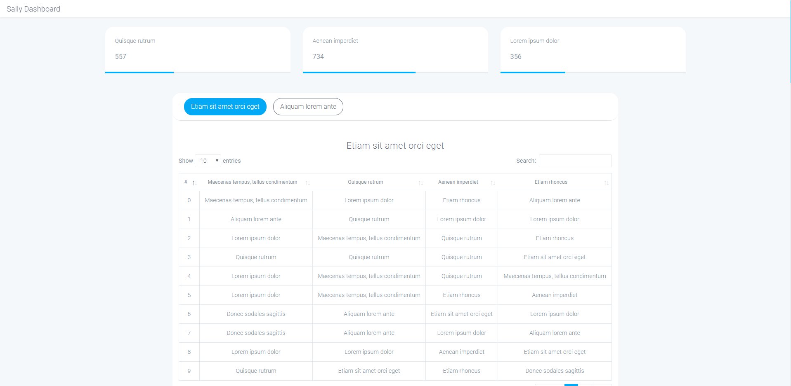

## Alright, now i can see demo statistics on my page, how can i pass my own statistic?
Create your own class which will extends from 
\Sally\Dashboard\Domain\Statistic\AbstractStatisticFiller and put this class wherever you want. 
In this class you will generate your statistics objects.
```php
<?php

namespace App;

use Sally\Dashboard\Domain\Statistic\AbstractStatisticFiller;

class StatisticFiller extends AbstractStatisticFiller
{
    public function fill(): void
    {
        
    }
}
```

And create bind record in app/Providers/AppServiceProvider in boot method
```php
    /**
     * Bootstrap any application services.
     *
     * @return void
     */
    public function boot()
    {
        $this->app->bind(
            AbstractStatisticFiller::class,
            StatisticFiller::class
        );
    }
```

_You can create statistics object by using nature factory or StatisticFacade class._

## Example
```php
<?php

namespace App;

use Sally\Dashboard\Domain\Statistic\AbstractStatisticFiller;
use Sally\Dashboard\Domain\Statistic\StatisticCreator;

class StatisticFiller extends AbstractStatisticFiller
{
    public function fill(): void
    {
        $this->addStatistic(
            StatisticCreator::createText('Test Card 1', 100)
        );

        $this->addStatistic(
            StatisticCreator::createText('Test Card 2', 200)
        );

        $this->addStatistic(
            StatisticCreator::createText('Test Card 3', 'You also can pass string')
        );

        $this->addStatistic(
            StatisticCreator::createDiagramPie('Demo Pie', [
                'Test Value 1' => 200,
                'Test Value 2' => 200,
                'Test Value 3' => 200,
            ])
        );

        $this->addStatistic(
            StatisticCreator::createDiagramDoughnut('Demo Doughnut', [
                'Test Value 1' => 200,
                'Test Value 2' => 200,
                'Test Value 3' => 200,
            ])
        );

        $this->addStatistic(
            StatisticCreator::createDiagramLine('Demo Line', [
                '25.04.2020' => [
                    'Test Value 1' => 100,
                    'Test Value 2' => 200,
                    'Test Value 3' => 300,
                ],
                '26.04.2020' => [
                    'Test Value 1' => 400,
                    'Test Value 2' => 500,
                    'Test Value 3' => 600,
                ],
                '27.04.2020' => [
                    'Test Value 1' => 240,
                    'Test Value 2' => 350,
                    'Test Value 3' => 450,
                ],
            ])
        );
    }

}
```

If your StatisticFiller class looks like this - you will see this
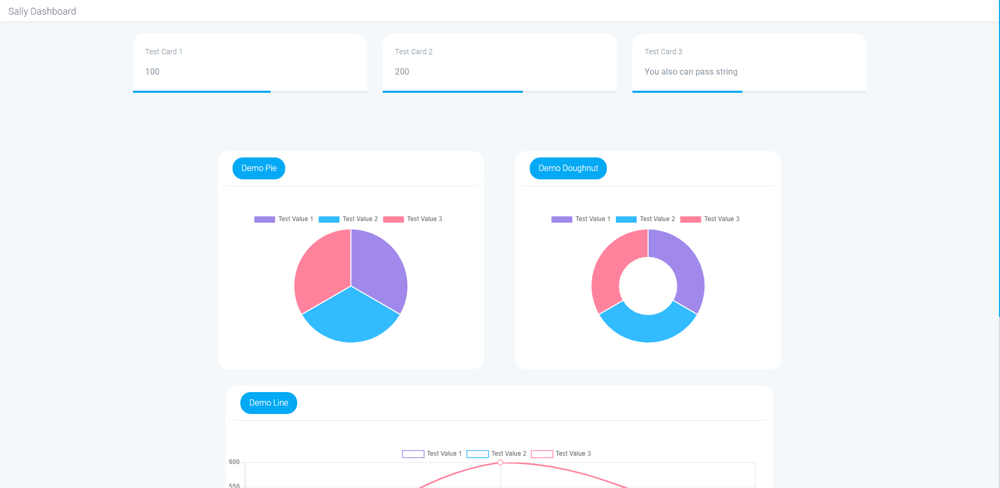
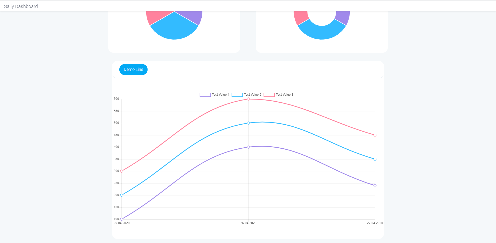

You can also use Factory
```php
<?php

namespace App;

use Sally\Dashboard\Domain\Statistic\AbstractStatisticFiller;

class StatisticFiller extends AbstractStatisticFiller
{
    public function fill(): void
    {
        $this->addStatistic(
            $this->getFactory()->getCommonFactory()->text('Test Card 1', 100)
        );

        $this->addStatistic(
            $this->getFactory()->getCommonFactory()->text('Test Card 2', 200)
        );

        $this->addStatistic(
            $this->getFactory()->getCommonFactory()->text('Test Card 3', 'You also can pass string')
        );

        $pie = $this->getFactory()->getDiagramFactory()->pie('Demo Pie');
        $pie->addItem('Test Value 1', 200);
        $pie->addItem('Test Value 2', 200);
        $pie->addItem('Test Value 3', 200);
        $this->addStatistic($pie);

        $dougnut = $this->getFactory()->getDiagramFactory()->doughnut('Demo Doughnut');
        $dougnut->addItem('Test Value 1', 200);
        $dougnut->addItem('Test Value 2', 200);
        $dougnut->addItem('Test Value 3', 200);
        $this->addStatistic($dougnut);

        $line = $this->getFactory()->getDiagramFactory()->line('Demo Line');
        
        $line->addItem('Test Value 1', 100, '25.04.2020');
        $line->addItem('Test Value 2', 200, '25.04.2020');
        $line->addItem('Test Value 3', 300, '25.04.2020');

        $line->addItem('Test Value 1', 400, '26.04.2020');
        $line->addItem('Test Value 2', 500, '26.04.2020');
        $line->addItem('Test Value 3', 600, '26.04.2020');

        $line->addItem('Test Value 1', 240, '27.04.2020');
        $line->addItem('Test Value 2', 350, '27.04.2020');
        $line->addItem('Test Value 3', 450, '27.04.2020');
        
        $this->addStatistic($line);
    }

}

```

## Screenshots


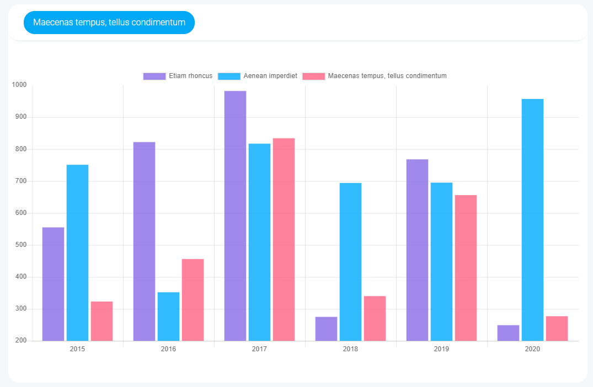
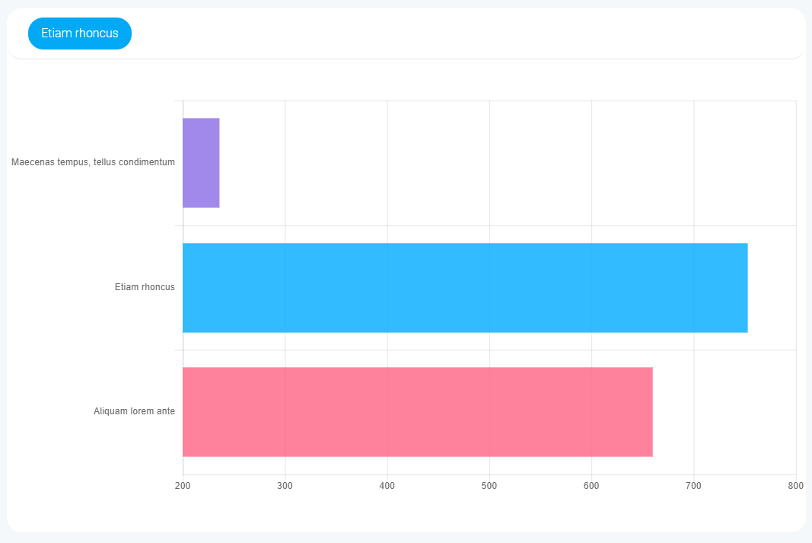
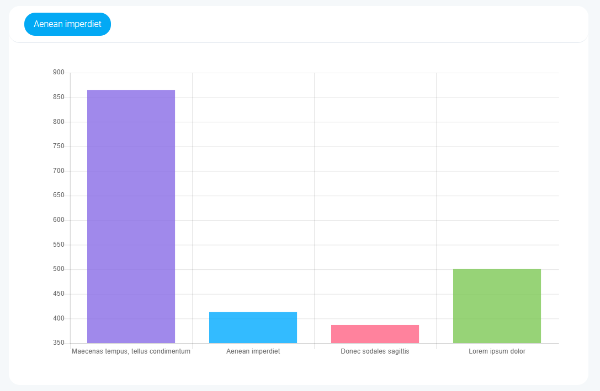
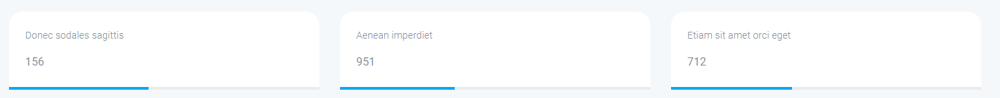
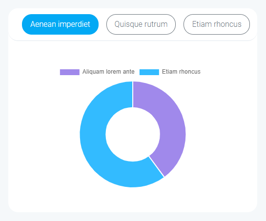

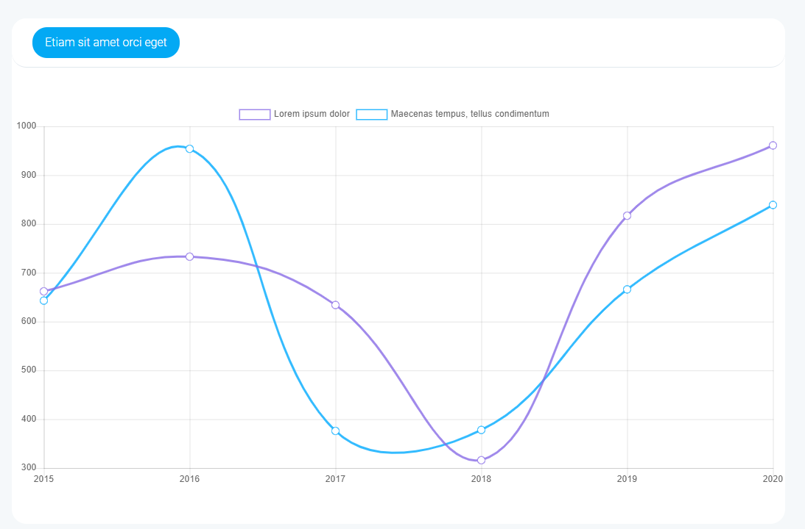
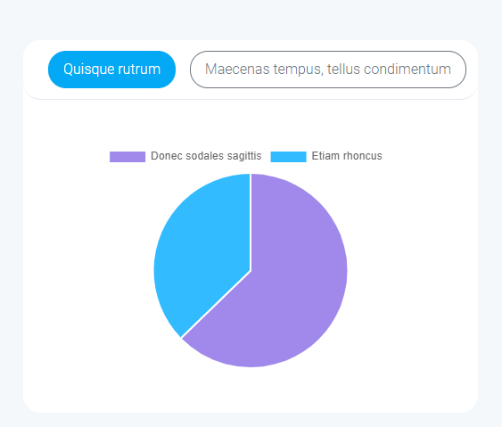
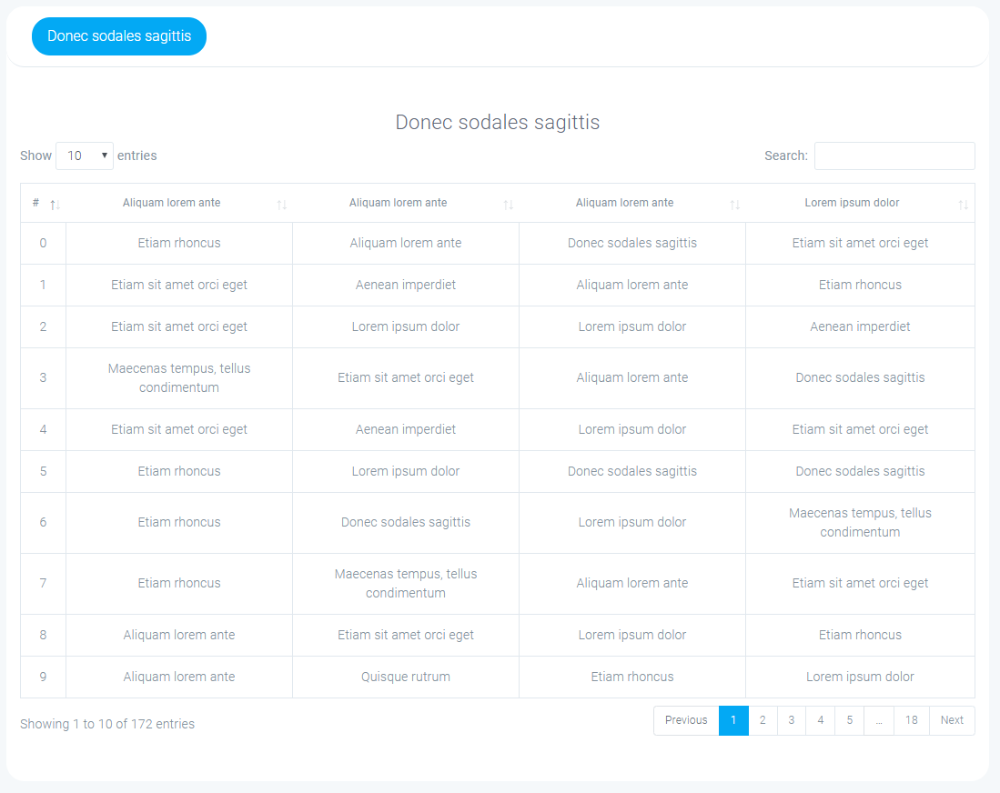
